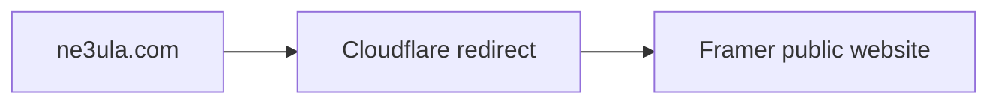
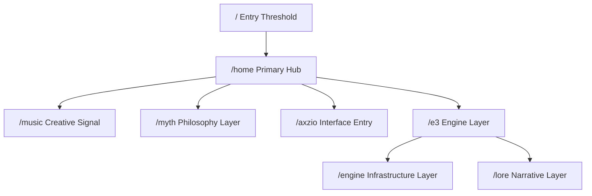

# NE3ULA — Navigation and System Diagram

## Current public production



This production redirect is confirmed context and must not be changed without explicit approval.

## Current repository route model



This diagram represents preserved legacy/static and SvelteKit coded routes. It is not the public-production navigation map.

See `CODED_SITE_REFERENCE.md` for the coded route purposes, existing user journey, and navigation conventions.

## Proposed Forge navigation (not implemented)

```mermaid
flowchart LR
    F[Framer CTA] -. proposed link .-> G[forge.ne3ula.com/]
    G --> L[/login]
    G --> J[/join]
    L --> C[/auth/callback]
    J --> C
    C --> D[/dashboard]
    L --> R[/auth/reset-password]
```

The Forge diagram is a recommendation pending approval. No routes, DNS, redirects, or deployments are configured by this document.
